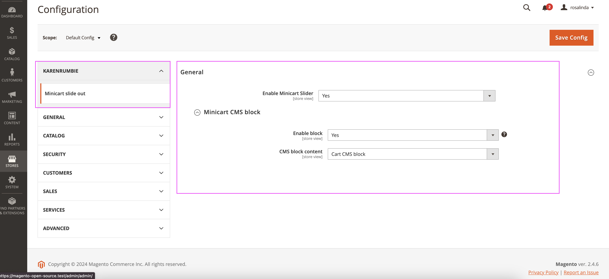

# Minicart slide out module

`karenrumbie/minicartslider`

- [KarenRumbie Minicart slide out](#karenrumbie-minicartslider)
    - [Main Functionalities](#main-functionalities)
    - [Installation](#installation)
    - [Configuration](#configuration)

## Main Functionalities

Brief description of what the module does.

```bash
A module which provides a cart slide out from the right instead of the traditional cart hover. The module has the option to display a selected CMS block when minicart is empty. Content Manager can select a CMS block from a dropdown list of static blocks in backend. 
```

## Installation

Add the following to your main composer.json file:

```json
    "repositories": [
        ...
        {
            "type": "vcs",
            "url": "https://github.com/KarenRumbidzai/minicartslider.git"
        }
    ]
```

Next, install the module via composer as follows:

```bash
$ composer require karenrumbie/minicartslider:1.0.0
$ composer update -vvv
```

After the composer installation has finished, activate the module by running the following commands from your Magento 2 root directory:

```bash
$ php bin/magento module:enable KarenRumbie_MiniCartSlider

$ php bin/magento setup:upgrade;
$ php bin/magento di:compile;
```

## Configuration

Configuration needed for module to work.

```bash
Module can be enabled/disabled in admin. It display under Stores > Configuration > KarenRumbie > Minicart slide out
```



